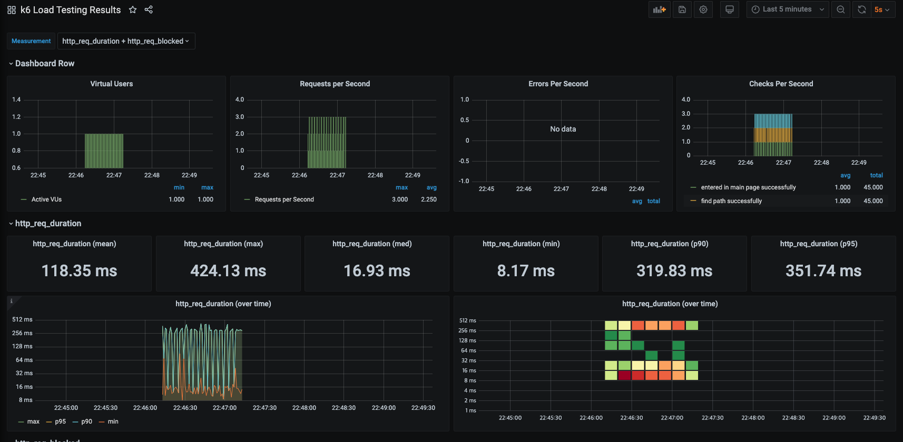
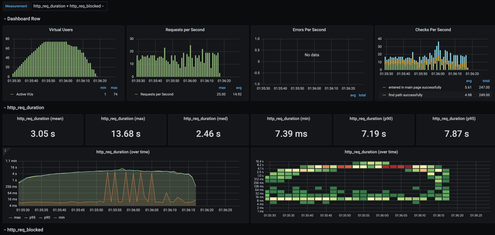
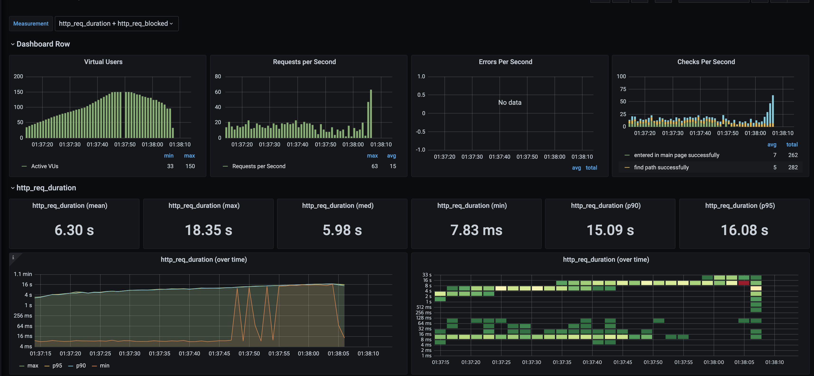

<p align="center">
    
</p>
<p align="center">
  
  
  <a href="https://edu.nextstep.camp/c/R89PYi5H" alt="nextstep atdd">
    
  </a>
  
</p>

<br>

# 인프라공방 샘플 서비스 - 지하철 노선도

<br>

## 🚀 Getting Started

### Install
#### npm 설치
```
cd frontend
npm install
```
> `frontend` 디렉토리에서 수행해야 합니다.

### Usage
#### webpack server 구동
```
npm run dev
```
#### application 구동
```
./gradlew clean build
```
<br>


### 1단계 - 웹 성능 테스트
1. 웹 성능예산은 어느정도가 적당하다고 생각하시나요

|     | 서울교통공사 | 네이버지도  | 카카오맵 | Running Map |
|-----|-----------|----------|--------|-------------|
| FCP | 6.2s      | 2.2s     | 1.7s   | 14.6s       |
| SI  | 7.8s      | 6.0s     | 7.4s   | 14.6s       |
| LCP | 6.4s      | 7.6s     | 6.7s   | 15.1s       |
| TTI | 8.3s      | 6.5s     | 4.5s   | 15.1s       | 
| TBT | 0.510s    | 0.360s   | 0.050s | 0.480s      |
| CLS | 0         | 0.4      | 0.005  | 0.041       |
위 성능 테스트는 https://pagespeed.web.dev/ 에서 나온 결과를 바탕으로 작성하였습니다.

지하철 노선도의 성격상 보여주는 것이 가장 중요하다고 생각합니다. <br>
따라서, `FCP`를 가장 높은 우선 순위로 선정해서 예산을 선정하였습니다. <br>
그리고 비교 대상 중 사람들이 많이 이용할 것으로 예상되는 애플리케이션인  
`네이버지도`, `카카오맵`의 성능의 평균정도는 되어야 경쟁력이 있다고 생각했습니다. <br>
<br>
따라서, 모바일 환경에서 `FCP`가 약 `2s`정도는 되어야 한다고 생각합니다.

2. 웹 성능예산을 바탕으로 현재 지하철 노선도 서비스의 서버 목표 응답시간 가설을 세워보세요.

현재 지하철 노선도의 `FCP`는 `14.6s`으로 목표치인 `2s`가 되려면 `8.6s`의 절감이 필요합니다. <br>
`PageSpeed Insights`에 따르면
텍스트 압축 사용만으로 전송 크기가 감소하여 `9.15s`의 절감이 예상됩니다. <br>
그 외 사용하지 않는 CSS를 줄이거나 렌더링 차단 리소스를 제거함으로서 소폭 절감될 것으로 예상됩니다.

따라서, `FCP` 목표치인 `2s`가 달성될 수 있을거라 생각됩니다.

---

### 2단계 - 부하 테스트 
1. 부하테스트 전제조건은 어느정도로 설정하셨나요 
   1. 대상 시스템 범위
      1. 홈 페이지
      2. 경로 검색
      3. 로그인
   2. 목푯값 설정 (latency, throughput, 부하 유지기간)
      1. Latency: 50ms
      2. Throughput: 77 ~ 144
         - DAU: 336만(22.11.5 기준 네이버지도 DAU(516만)와 카카오맵 DAU(219만)의 평균 값)
         - 1명당 1일 평균 접속 수: 2(출, 퇴근)
         - 1일 총 접속 수: 672만
         - 1일 평균 rps: 77
         - 1일 최대 rps: 144(최대 트래픽을 평소의 2배로 잡음)
      3. 부하 유지기간: 1분
   3. 부하 테스트 시 저장될 데이터 건수 및 크기: 저장될 데이터 없음

2. Smoke, Load, Stress 테스트 스크립트와 결과를 공유해주세요
   1. Smoke
   
   2. Load
   
   3. Stress
   

---

### 3단계 - 로깅, 모니터링
1. 각 서버내 로깅 경로를 알려주세요

2. Cloudwatch 대시보드 URL을 알려주세요
